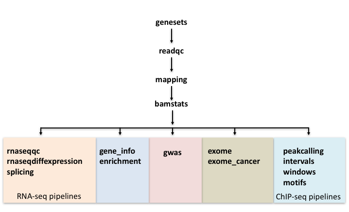

Background
============

Introduction
------------

There really are two types of pipelines. In ``production pipelines`` the inputs are usually
the same every time the pipeline is run and the output is known beforehand. For example,
read mapping and quality control is a typical pipeline. These pipelines can be well optimized
and can be re-used with little change in configuration.

``analysis pipelines`` control scientific analyses and are much more in a state of flux.
Here, the input might change over time as the analysis expands and the output will change
with every new insight or new direction a project takes. It will be still a pipeline as long as
the output can be generated from the input without manual intervention. These pipelines leave
less scope for optimization compared to ``production pipelines`` and adapting a pipeline to
a new project will involve significant refactoring.

In CGAT, we are primarily concerned with ``analysis pipelines``, though we have some
``production pipelines`` for common tasks.

There are several ways to build pipelines. For example, there are generic workflow
systems like `taverna <http://www.taverna.org.uk>`_ which even provide GUIs for connecting
tasks. A developer writes some glue code permitting the output of one application to
be used as input for another application. Also, there are specialized workflow systems 
for genomics, for example galaxy_, which allows you to save and share analyses. New tools
can be added to the system and new data imported easily for example from the UCSC genome browser.

CGAT Pipelines are a collection of workflows built using the lightweight Python library ruffus_. ruffus 
acts as the glue to run our workflows.

Code organisation
-----------------

Our code is organised with the following structure in mind:

  * **Scripts** -
    Stand-alone scripts following the `Unix design philosophy <http://wiki.c2.com/?UnixDesignPhilosophy>`_.
    The scripts are located in a different `repository <https://github.com/CGATOxford/cgat>_`.

  * **Modules** -
    Modules providing building blocks for the pipelines, bringing together common functionality for
    a group of related tasks, in order to maximise code reusability.

  * **Pipelines** -
    A python script defining the workflow (with ruffus tasks).

Production pipelines
--------------------

We have a number of production pipelines that have been developed in CGAT. Our philosophy is to
structure our analysis workflows so they are as modular as possible. For example, we do not have
a single ChIP-seq pipeline because we want our pipelines to only run tasks that are specific to
the experimental approach. Therefore, we have seperate pipelines for running different analysis
associated with ChIP-seq.

**Below is a flow and organisation of our production piplines:**

Our generic pipelines, such as genesets, readqc, mapping and bamstats are not specific for any
particular workflow and are usually ran for every NGS workflow. Our other production pipelines
are usually specific for a particular experimental approach and you should read the documentation
for the required inputs and the expected outputs from running these.

Building your own pipelines
---------------------------

When building pipelines it is often useful to keep in mind the following philosophy: 

Flexibility
   There are always new tools and insights that could be incorporated into a pipeline.
   Ultimately, a pipeline should be flexible and the code should not constraining you
   implimenting new features.

Scriptability
   The pipeline should be scriptable, i.e, the whole pipeline can be run within
   another pipeline. Similarly, parts of a pipeline can be duplicated to process 
   several data streams in parallel. This is a crucial feature in genome studies
   as a single analysis will not permit making inferences by itself. For example,
   consider you find in ChIP-Seq data from a particular transcription factor that
   it binds frequently in introns. You will need to run the same analysis on 
   data from other transcription factors in order to assess if intronic binding is
   remarkable. When CGAT write a pipeline we usually write a command line `script
   <http://github.com/CGATOxford/cgat/tree/master/CGAT/scripts>`_ and then run this
   script as a command line statement in the pipeline.

Reproducibility
   The pipeline is fully automated. The same inputs and configuration will produce
   the same outputs.

Reusability
   The pipeline should be able to be re-used on similar data, preferably only requiring 
   changes to a configuration file (Pipeline.ini).

Archivability
   Once finished, the whole project should be able to archived without too many
   major dependencies on external data. This should be a simple process and hence
   all project data should be self-contained. It should not involve going through 
   various directories or databases to figure out which files and tables belong
   to a project or a project depends on.

