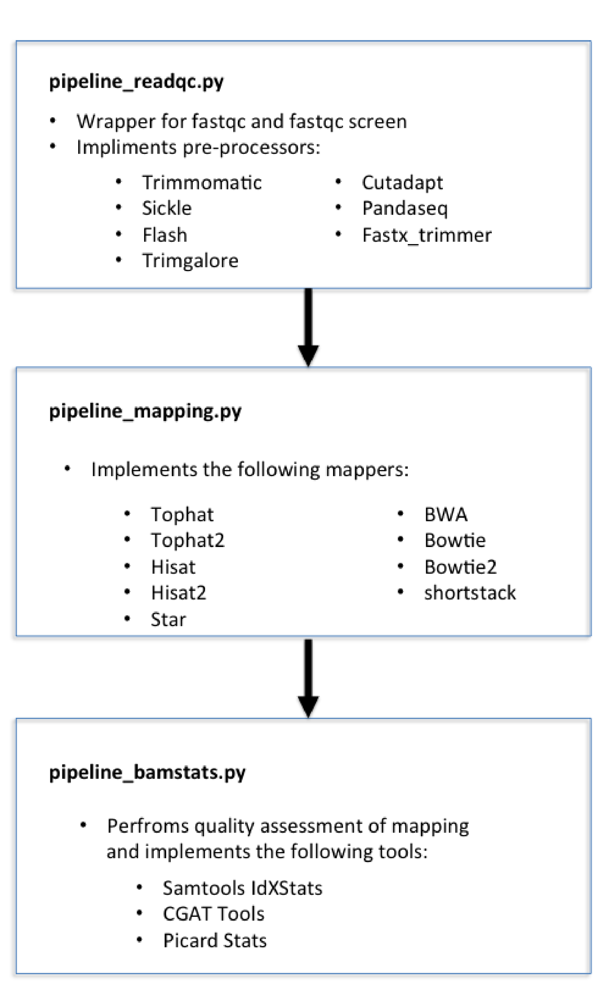

=========
Tutorials
=========

This section gives examples of how our NGS workflows can be executed. 

Introduction
============

Before beginning this tutorial make sure you have CGAT Piplines and CGAT Tools installed correctly,
please see here (see :ref:`CGATSetup`) for installation instructions.

As a pre-requesit for running our production pipelines we suggest you run the pipeline_geneset.py (LINK),
however for the purposes of this tutorial we are going to download the output of annotations pipeline
for the genopme build, hg38. We will also use bowtie2 indexes and the hg38.fa downloaded from iGenomes_ from Illumina .
iGenomes is a collection of reference sequences and annotation files for commonly analysed organisms. Since
the hg38 reference that we will use for these examples is 14Gb, we have already downloaded this and
extracted the information necessary for running the following tutorials.

Common to all of our NGS analysis are three production pipelines, one that perfroms quality assessment of the reads,
the second performs mapping of those reads to a reference genome and a third pipeline that performs quality metrics of
the mapping. These three pieplines are critical for identifying quality issues prior to perfrming downstream analysis of the data.
The functionality and the third-party software that they wrap are detailed below:

**A summary of what each pipeline does is shown below:**

Examples
========

pipeline_readqc.py
------------------

The aim of this pipeline is to perform quality assessment of the reads following sequencing. The
pipeline also performs read pre-processing such as quality trimming or adaptor removal through the
implimentation of a number of third party tools such as trimmgalore, timmomatic, sickle, cutadapt,
pandaseq and flash.

For documentation of the pipeline please see the documentation for *PIPELINE_READQC:READ QC AND PROCESSING BEFORE MAPPING* in the site navigation menu.

Initally this piepline is ran one to assertain the read quality then, if it is oberved that
trimming or downstream adapter removal is needed then the pipeline is ran for a second time
after specifying these in the configuration files pipeline.ini

**1.** First download the tutorial data::

   mkdir pipeline_readqc
   cd pipeline_readqc/
   wget https://www.cgat.org/downloads/public/cgatpipelines/Tutorial_data/tutorial_fastq.tar.gz
   tar -zxvf tutorial_fastq.tar.gz

**2.** The next thing is to generate the pipeline configuration file by::

   cgatflow readqc config

**3.** This will generate a **pipeline.ini** configuration file. This is the file that can be modified to
alter the workflow of the pipline. However, for the first run of the readqc pipeline, the .ini file
does not need to be modified. To run the pipeline do the following::

   cgatflow readqc make full -v 5 --local

This ``--local`` will run the pipeline locally if you do not have access to a cluster. Alternatively if you have a
cluster remove the ``--local`` option and the pipleine will distribute your jobs accross the cluster.

.. note:: 

   If you get the following sqlite error while running the pipeline please continue running the pipeline with a
   single process as follows ``cgatflow readqc make full -v5 -p1 --local`` and the pipeline should complete without
   errors. This occurrs because sqlite cannot handle multi-threaded access. Although we have added a fix for most
   cases, this can sometimes not always work. 

**4.** The **final step** is to generate the report. We have a preference for multiqc, however we also have our own
CGAT report implimented in this pipeline. To generate the reports run the command::

   cgatflow readqc make build_report -v 5 --local

This will generate a multiqc report in the folder MultiQC_report.dir and CGAT report in the folder /report/html/.

Depending on the report, you may now wish to run a trimming tool. In order to do this you will need
to modify the `pipeline.ini` file and specify in the preprocessing options which trimmer you would
like to run and then set the parameters of that tool. For the example of this tutorial, you will
need to modify the trimmomatic section in the .ini file. 
In the following example we will run trimmomatic. 

**5.** Set the preprocessing options in the pipeline.ini file to specify trimmomatic
::

    ################################################################
    ################################################################
    # preprocessing options
    ################################################################
    # these options will only work if you have run the 
    # readqc_pipeline previously
      
    # specify a comma seperated list of preprocessing tools to run
    # current options are:
    # trimmomatic
    # trimgalore
    # fastx_trimmer
    # sickle
    # flash
    # reversecomplement
    # pandaseq
    preprocessors=trimmomatic

**6.** Set the options for trimmomatic
::

    ################################################################
    ################################################################
    ##### trimmomatic options
    ################################################################
    [trimmomatic]
    # http://www.usadellab.org/cms/?page=trimmomatic
    #options
    options=LEADING:3 TRAILING:3 SLIDINGWINDOW:4:15 MINLEN:15  

    # if adapter removal is required, specify the location of a fasta file
    # containing adapters and define the adapter parameters
    # this variable will be overriden if auto_remove != 0
    # For the tutorial this is downloaded with the fastq files in the tar ball
    adapter=TruSeq2-PE.fa

    # max mismatches in adapter sequence  
    mismatches=5

    # accuracy thresholds. these values are (very roughly speaking) log-10
    # probabilities of getting a match at random
    # A threshold of 10 requires a perfect match of ~17bp (see above website)
    c_thresh=10

    # only used in paired end mode  
    p_thresh=30

**7.** Then run the pipeline to with the task ``full`` the regenerate the report::

   cgatflow readqc make full -v 5 --local
   cgatflow readqc make build_report -v 5

this completes the tutorial for running the readqc pipeline. 

pipeline_mapping.py
-------------------

The aim of this pipeline is to map reads agains a reference genome. Within this piepline we have
implimented a number of mappers such as bowtie, bowtie2, bwa and shortstack, in addition to a 
number of spliced mappers such as star, Tophat, hisat and hisat2. The pipeline can work from sra,
single end fastq and paired-end fastq files.

For documentation of this pipeline please see here PIPELINE_MAPPING:SHORT READ MAPPING AND QC in the navigation panel.

To perform mapping, the configuration file (pipeline.ini) needs to amended to specify the specific
mapper that is required. 

**1.** The first thing is to make a folder and download the iGenomes/annotations data. Please not that this is a 5Gb file
and may take some time to download::

   mkdir pipeline_mapping
   cd pipeline_mapping/
   wget https://www.cgat.org/downloads/public/cgatpipelines/Tutorial_data/annotations_tutorial.tar.gz
   tar -zxvf annotations_tutorial.tar.gz

**2.** Next download the tutorial data::

   wget https://www.cgat.org/downloads/public/cgatpipelines/Tutorial_data/tutorial_fastq.tar.gz
   tar -zxvf tutorial_fastq.tar.gz

**3.** Next generate a configuration file as follows::

   cgatflow mapping config

**4.** Set the options in the pipleine.ini file. We are going to run the bowtie2 mapper and therefore we need to
specify the location of the annotations and in the bowtie2 section specify the location of the inicies and running
options.

**Setting the general options:**
::

    [general]
    # directory where reads are located, specified as:
    # "0" for the current directory "."
    # "1" for the subdirectory "./data.dir".
    # alternative a path may be specified, but this is not recommended.
    input=0

    genome=genome

    # directory where exported data is located
    exportdir=export

    # location of indexed genome, needs to be set
    genome_dir=./annotations_tutorial/WholeGenomeFasta

    # scratchdir for data not to be backed up
    scratchdir=/tmp

    # a version string
    version=

    # directory for publishing results on the web
    web_dir=../web

    # maximum intron size - transcripts with longer introns
    # will be ignored
    max_intron_size=2000000

    # mappers to run
    # valid mappers are:
    # tophat
    # tophat2
    # bowtie
    # bowtie2
    # bwa
    # star
    # stampy
    # shortstack
    # butter
    # hisat  
    # (bfast)
    # (shrimp)
    mappers=bowtie2

    # Strand Assignment for spliced mapping
    # Using HISAT nomenclature, more detail available at
    # http://www.ccb.jhu.edu/software/hisat/manual.shtml#options
    # under --rna-strandness
    # FR = secondstrand paired-end
    # RF = firststrand paired-end
    # F = secondstrand single-end
    # R = firststrand single-end
    # 
    # Paired-end sequencing after TruSeq Library Prep is "RF"
    #
    # Default = empty: unstranded
    # Required for all spliced alignment
    strandness=

    # Strip read sequence and quality information.
    # Saves space for rnaseq and chipseq runs, but 
    # sequence and quality information necessary for
    # variant calling
    #
    # Enabled by default
    strip_sequence=0

    # remove non-unique matches in a post-processing step.
    # Many aligners offer this option in the mapping stage
    # If only unique matches are required, it is better to
    # configure the aligner as removing in post-processing
    # adds to processing time.
    remove_non_unique=0

    [database]
    name=csvdb
    ################################################################
    ################################################################
    ################################################################
    ## Location of annotation database - needs to be set
    ################################################################
    [annotations]
    #annotations database
    database=./annotations_tutorial/hg38_ensembl87/csvdb

    # directory with annotation information
    dir=./annotations_tutorial/hg38_ensembl87/

    ################################################################
    ################################################################
    ################################################################
    # options for building geneset
    ################################################################
    [geneset]
    # set, if ribosomal and other repetetive rna genes should be removed
    # (note: lincRNA are kept in)
    remove_repetetive_rna=1

    # pattern to match for contigs to remove
    remove_contigs=chrM|chrMT|_random|chrUn|_hap|chrGL|chrHSCHR

    # minimum flanking error for isoform annotation
    flank=5000

**Setting the bowtie2 options:**

::

    [bowtie2]
    # bowtie executable
    executable=bowtie2

    # directory with bowtie indices
    index_dir=./annotations_tutorial/Bowtie2Index

    # options for mapping with bowtie2
    # !! For paired end mapping note that the default max insert length is 250 !!
    # !! This can be modified with -X                                          !!
    options=-k 5

    # threads to use
    threads=12

    # memory required for bowtie jobs - per thread
    memory=1.9G

**5.** Next run the pipeline_mapping to full. Be aware that you will most likely need to run this job on a cluster
because of the heavy use of memory for bowtie2. To do this first ``ssh` into your cluster and run the pipeline from
there.

::

    cgatflow mapping make full -v5

**6.** To visualise the report next run multiqc by:

::

    cgatflow mapping make build_report -v5

The report that is generated from the mapping tools are very vague and not very complex in their reporting. Therefore, it is imperitive
that you run pipeline_bamstats.py to determine your mapping quality. This now conludes the mapping tutorial. The next step in the NGS 
workflow is to determine the quality of your mapping output below.

pipeline_bamstats.py
--------------------

The aim of this pipeline is to perform mapping quality assessment. The pipeline required a bam file as
an input and impliments the following theird-party tools: samtools IdxStats, Bamstats, PicardStats, CGAT tools.
In addition to this we also impliment a number of pipeline specific quality metrcs. 

For documentation of the pipeline please see the documentation for PIPELINE_BAMSTATS:QC FOLLOWING MAPPING in the site navigation.

**1.** Download the annotation data::

   mkdir pipeline_mapping
   cd pipeline_mapping/
   wget https://www.cgat.org/downloads/public/cgatpipelines/Tutorial_data/annotations_tutorial.tar.gz
   tar -zxvf annotations_tutorial.tar.gz

**2.** Next download the tutorial data::

   wget https://www.cgat.org/downloads/public/cgatpipelines/Tutorial_data/tutorial_bams.tar.gz
   tar -zxvf tutorial_bams.tar.gz

**3.** The next thing is to generate the pipeline configuration file by::

   cgatflow bamstats config

**4.** This will generate a **pipeline.ini** configuration file. This is the file that can be modified to
alter the workflow of the pipline. For running the pipeline tutorial the following options should be set:

**Setting the general options:**
::

      [general]

      # directory where reads are located, specified as:
      # "0" for the current directory "."
      # "1" for the subdirectory "./data.dir".
      # alternative a path may be specified, but this is not recommended.
      input=0

      # genome is ucsc convention
      genome=hg38

      # directory where exported data is located
      exportdir=export

      # location of indexed genome, needs to be set
      genome_dir=/ifs/mirror/genomes/index

      # scratchdir for data not to be backed up
      scratchdir=/tmp

      # a version string
      version=

      # directory for publishing results on the web
      web_dir=../web

      # Strand Assignment for spliced mapping
      # Using HISAT nomenclature, more detail available at
      # http://www.ccb.jhu.edu/software/hisat/manual.shtml#options
      # under --rna-strandness
      # FR = secondstrand paired-end
      # RF = firststrand paired-end
      # F = secondstrand single-end
      # R = firststrand single-end

      # default = empty: unstranded
      strandness=

**Bamstats options:**
::

      [bam]

      paired_end=0

      # sometimes a bam has its sequence quality stripped to save space
      # if this is the case then specify below:
      sequence_stipped=1

      ################################################################
      ## name of the database that you want to generate
      ################################################################
      [database]

      name=csvdb

      ################################################################
      ## Location of database following the running pipeline_gtf_subset.py 
      ################################################################
      [gtf]

      #database location 
      database=./annotations_tutorial/hg38_ensembl87/csvdb

      # location that pipeline_bamstats.py was ran
      dir=./annotations_tutorial/hg38_ensembl87/

**5.** To run the pipeline do the following::

   cgatflow bamstats make full -v 5 --local

This ``--local`` will run the pipeline locally if you do not have access to a cluster. Alternatively if you have a
cluster remove the ``--local`` option and the pipleine will distribute your jobs accross the cluster.

**6.** To visualise the report next run multiqc by:

::

    cgatflow bamstats make build_report -v5

Running the report command will generate three different types of reports:
  1. A Jupyter notebook implimentation - found in the Jupyter_report.dir/CGAT_FULL_BAM_STATS_REPORT.html
  2. An Rmarkdown report - found in R_report.dir/index.html
  3. A multiqc report implimentation - accessed at MultiQC_report.dir/multiqc_report.html

Conclusion
==========

These three tutorials are designed to give users a flavour of how to run our upstream NGS production pipelines.It is hoped that
once familiar with the workflows and design of our pipelines users will be encouraged to cotribute to the code development, the
code is constant development and we look forward for new users to incorporate these pipelines in their analysis. 
